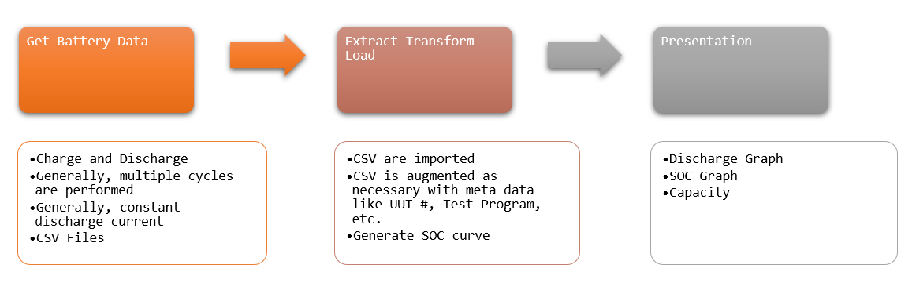

 
<h3 align=center>Battery Test Process</h2>
<h4 align=center>This is the process I use for testing battery performance</a>.</h3>
 

## Abstract

## Background

### Definitions
<dl>
<dd><i>VBAT</i></dd>
<dt>The voltage across the battery under load. This works relatively poorly as a factor for determining battery SOC because <i>VBAT</i> is not path independent – it is not a state variable.</dt>
<dd>State of Charge (SOC)</dd>
<dt>The percentage of full-charge in the battery. For the work here, I model the SOC as a function of voltage, i.e. $ SOC = f\(V_{BAT}\)$. This is a gross oversimplification, but the only "state" variable I have available is battery voltage. While open-circuit <i>VBAT</i> is not a bad indicator of battery charge, I only have <i>VBAT</i> under load available and I do not know the load current.</dt>
</dl>

### Data Format

#### Maccor

Multi-cycle and mult-battery testing is normally done on an Arbin or Maccor battery tester – only the Maccor is readily available to me. The Maccor has its own programming language and I generate a test profile using this language. The Maccor has a standard output format that requires some cleanup for easy analysis. The cleanup is pretty basic:

* Remove the header rows These rows contain test metadata and are not used in this analysis work – it could be. I used a filename standard that contains all the metadata that I use and I extract this info from the file name.
* Remove unused columns There are many columns that contain information that I do not use: AC impedance, DC resistance, Watt-hours, etc. There are also a large number of null columns that can be configured by the user. Those are deleted as well.
* Step-Time column This column contains a custom time format that must be converted to a useful format.

#### Keithley 2401A

Single battery – single cycle battery testing is done using the Keithley 2401A sourcemeter. I control the unit using Python and the pymeasure library. 

### ETL

### SOC Calculation

## Analysis

### Discharge Curve

### SOC Calculation

### Battery Capacity

## Conclusion